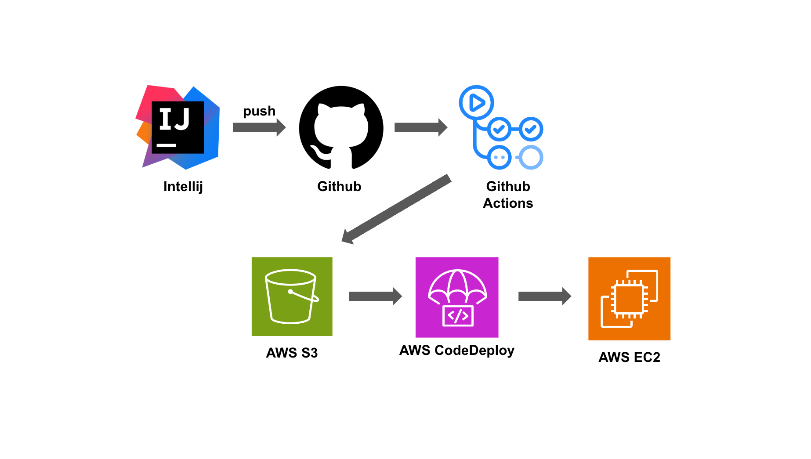

# pinterest
핀터레스트 클론 코딩

## 기능

1. Board 등록
2. Article 등록
3. 다른 사람이 등록한 Board를 구독
4. 다른 사람이 등록한 Article에 좋아요 기능
5. 내가 구독하고 좋아요 누른 게시물에 대해 한 눈에 볼 수 있는 페이지

## 기술스택
| 구분             | 기술 스택                                           |
|----------------|-------------------------------------------------|
| FrontEnd       | Thymeleaf, JavaScript, TailwindCss              |
| BackEnd        | JAVA, Spring Framework(Security), JPA, QueryDSL |
| Database       | MariaDB                                         |
| Cloud Services | AWS EC2, RDS, S3                                |
| CI / CD        | Github Actions, AWS CodeDeploy                  |
| TOOL           | Intellij                                        |

## 배포

